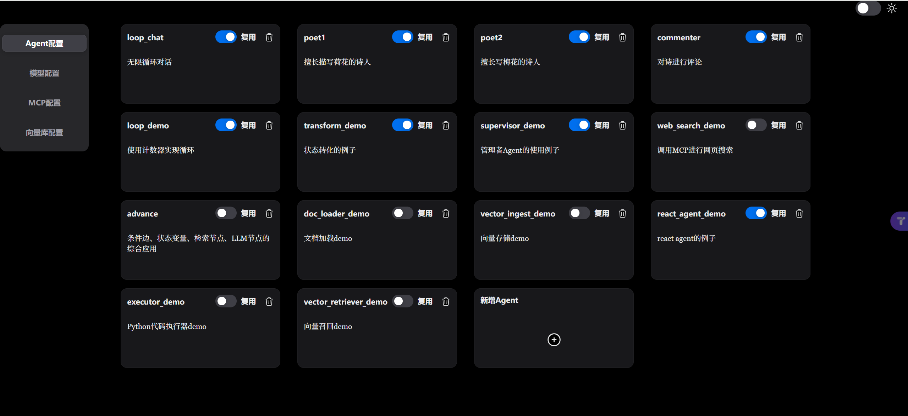

# Lang-Agent

本项目是以LangGraph为底层技术来实现的一个可有限编程的Agent配置平台。
传统的类WorkFlow项目一般只会将上一个节点的输出作为下一个节点的输入，Lang-Agent允许自定义[状态变量](#state)，可以作用于[节点](#节点)以及[条件边](#条件边)的输入和输出，从而实现更精准的控制。

Lang-Agent的设计理念更接近于comfyUI而不是dify和coze，鼓励使用者开发适应自身业务的节点。Lang-Agent具有良好的可扩展性，其扩展节点的开发可参考[自定义节点](#自定义节点)


<table>
  <tr>
    <td align="center">
      <br/>
      项目截图1
    </td>
    <td align="center">
      <br/>
      项目截图2
    </td>
    <td align="center">
      <br/>
      项目截图3
    </td>
  </tr>
</table>


## 技术栈

- [LangGraph](https://langchain-ai.github.io/langgraph/)
- [FastApi](https://fastapi.tiangolo.com/)
- [HeroUI](https://heroui.com)
- [ReactFlow](https://reactflow.dev/)
- [Tailwind CSS](https://tailwindcss.com)


## 安装与启动

本项目分为后端（lang-agent-backend）和前端（lang-agent-frontend）两个子项目。

### 克隆项目

```bash
git clone https://github.com/cqzyys/lang-agent.git
```

### lang-agent-backend安装和启动

#### 初始化Python环境
后端项目使用poetry进行包管理，poetry的使用方法可以参考[poetry官方文档](https://python-poetry.org/docs/#installing-manually)。

poetry安装完成后，进入后端项目目录，执行以下命令初始化项目环境。

```bash
cd lang-agent-backend
poetry env use python
poetry shell
poetry install 
```

#### 启动项目

```bash
python -m lang_agent.main
```


### lang-agent-frontend安装和启动


#### 安装项目
前端项目使用yarn进行包管理。yarn的使用方法可以参考[yarn官方文档](https://yarnpkg.com/getting-started/install)。

yarn安装完成后，进入前端项目目录，执行以下命令安装项目依赖包。

```bash
cd lang-agent-frontend
yarn install
```

#### 启动项目

```bash
yarn dev
```

默认访问地址 http://localhost:8820


## 使用说明

### 模型配置

点击【模型配置】标签，进入模型配置页面

点击右上角的【+】图标，可以创建一个模型的连接


- 名称：自定义模型的名称，要求唯一

- 类型：目前可以选择llm或者embedding。llm类型可用于[LLM节点](#llm节点)、[ReactAgent](#reactagent)、[SupervisorAgent](#supervisoragent)等节点，embedding类型可用于[向量召回节点](#向量召回节点)等节点

- 渠道：目前只支持兼容openai的渠道，后续会支持更多渠道

- 模型连接参数：模型连接参数，具体可参考[ChatOpenAI](https://python.langchain.com/api_reference/openai/chat_models/langchain_openai.chat_models.base.ChatOpenAI.html)


### MCP配置

MCP实质是为大语言模型提供访问外部服务的工具，只有在需要工具调用的场景才需要配置MCP。MCP可用于[ReactAgent](#reactagent)等节点。

点击【MCP配置】标签，进入MCP配置页面

点击右上角的【+】图标，可以配置一个MCP连接

- 名称：自定义MCP的名称，要求唯一

- 说明：自定义MCP的描述

- MCP参数：MCP的连接参数，具体请参考[langchain-mcp-adapters](https://github.com/langchain-ai/langchain-mcp-adapters)

### 向量库配置

只有在需要将文档转化为向量存储和进行向量检索的场景需要配置向量库。

点击【向量库配置】标签，进入向量库配置页面

点击右上角的【+】图标，可以配置一个向量库

- 名称：自定义向量库的名称，要求唯一

- 类型：目前只支持postgres和milvus两种类型的向量库

- URI：向量库的连接地址，具体请查看向量库的文档

- 用户名：向量库的连接用户名

- 密码：向量库的连接密码

- 数据库名：向量库的连接数据库名

- 集合名：向量库的连接集合名

- 嵌入模型：可选择[模型配置](#模型配置)中的embedding模型

### Agent配置

Agent配置是本项目的核心功能，目的是通过可视化的拖拽和输入来配置各种复杂的AI Agent。

点击【Agent配置】标签，进入Agent列表。再点击【新增Agent】卡片，进入Agent配置页面。

Agent配置页面分为左右两部分。左侧部分称为`资源树`，列出可用于构建Agent的元素，包含[节点](#节点)、[Agent](#agent)和[边]()。右侧部分称为`画布`，是展现和配置Agent的主界面。可以将左侧的节点和Agent拖拽到右侧的`画布`区域来组合成新的Agent。

#### 节点

节点，LangGraph核心概念，是构成Agent的基本元素，绝大部分的程序逻辑通过节点来实现。通过将`资源树`中的节点拖拽到`画布`中来创建节点，选中`画布`中的节点之后按backspace键可以删除节点

##### 开始节点

开始节点是Agent的起点，每一个Agent有且仅有一个开始节点。

- 名称：必要，需要保证在Agent中唯一
- 引导词：可选，如配置则在启动Agent时会有一段开场白
<a id="state"></a>
- 状态变量：必要，LangGraph核心概念，可以理解为在Agent内的一个全局字典，节点执行后会更新状态变量，也可以获取状态变量来进行节点和条件边的逻辑控制。默认至少有名为【messages】的状态变量用于存储会话消息，可根据实际业务添加自定义的状态变量。状态变量的使用请参考[状态变量使用规则](#状态变量使用规则)。

##### 结束节点

结束节点是Agent的终点，表示该Agent执行完毕。

##### 输入节点

当需要与用户交互时，加入输入节点用来接收用户的输入。参考用例[examples/loop_chat.json]()

- 名称：必要，需要保证在Agent中唯一
- 目标状态变量：必要，默认为【messages】，表示用户的输入会存储在【messages】状态变量中

##### LLM节点

即大语言模型节点，一般来说，一个Agent中至少会包含一个LLM节点，是实现各种场景的核心节点。参考用例[examples/poet1.json]()

- 名称：必要，需要保证在Agent中唯一
- 模型：必要，可选择[模型配置](#模型配置)中的llm模型
- 系统提示词：可选，大语言模型的系统提示词。系统提示词可以使用[状态变量](#state)，语法请参考[状态变量使用规则](#状态变量使用规则)。
- 用户提示词：可选，大语言模型的用户提示词。用户提示词可以使用状态变量，语法请参考[状态变量使用规则](#状态变量使用规则)。

##### 计数器节点

实现数量自增功能，需要搭配自定义的[状态变量](#state)使用。参考用例[examples/loop_demo.json]()

- 名称：必要，需要保证在Agent中唯一
- 目标状态变量：必要，表示控制哪个状态变量进行自增操作


##### 转换器节点

将输入转化并输出到目标状态变量，需要搭配自定义的[状态变量](#state)使用。参考用例[examples/transform_demo.json]()

- 名称：必要，需要保证在Agent中唯一
- 来源状态变量：可选，表示待转化的状态变量，如果不填写，则默认为messages状态变量
- 目标状态变量：必要，表示转化之后的值输出到哪个状态变量

##### 文档加载节点

可以上传txt、pdf、docx、md格式的文档，输出文档内容。参考用例[examples/vector_ingest_demo.json]()

- 名称：必要，需要保证在Agent中唯一
- 上传文档：必要，从本地选择上传的文档

##### 代码执行器节点

可以执行python代码，输出代码执行结果。参考用例[examples/executor_demo.json]()

- 名称：必要，需要保证在Agent中唯一
- Python代码：必要，在节点中执行的Python代码，必须用\`\`\`python\`\`\`包裹

##### 向量存储节点

自定义的向量数据库节点，实现向量存储功能。参考用例[vector_ingest_demo.json]()

- 名称：必要，需要保证在Agent中唯一
- 类型：必要，可选择的向量数据库类型(目前支持postgres和milvus)
- 向量库：必要，可选择[向量库配置](#向量库配置)中的向量库
- 文档内容：必要，需要进行向量化存储的文本内容。可以使用[状态变量](#state)，语法请参考[状态变量使用规则](#状态变量使用规则)。
- 文档描述：必要，定义文档的标记信息，便于在向量库中判断向量属于哪个文档。

##### 向量召回节点

自定义的向量数据库节点，实现向量召回功能。参考用例[vector_retriever_demo.json]()

- 名称：必要，需要保证在Agent中唯一
- 类型：必要，可选择的向量数据库类型(目前支持postgres和milvus)
- 向量库：必要，可选择[向量库配置](#向量库配置)中的向量库
- 召回关键字：必要，进行向量搜索的关键字。可以使用[状态变量](#state)，语法请参考[状态变量使用规则](#状态变量使用规则)。


#### Agent

Agent也可以看作是特殊的节点，有**预制Agent**和**可复用Agent**两种类型。

<a id="rebuilt_agent"></a>
**预制Agent**是项目已经封装好的Agent，可以直接拖拽到`画布`区域使用。

##### ReactAgent

让大语言模型自主调用MCP工具来获得最终输出，MCP工具需要提前在[MCP配置](#mcp配置)中完成。参考用例[examples/react_agent_demo.json]()

- 节点名称：必要，需要保证在Agent中唯一
- 模型：必要，可选择[模型配置](#模型配置)中的llm模型
- 工具：必要，可选择[MCP配置](#mcp配置)完毕后所能使用的工具

##### SupervisorAgent

让大语言模型自主调用其他[可复用Agent](#reuse_agent)来获得最终输出。参考用例[examples/supervisor_demo.json]()

- 节点名称：必要，需要保证在Agent中唯一
- 模型：必要，可选择[模型配置](#模型配置)中的llm模型
- Agent：必要，可选择已经配置好的[可复用Agent](#reuse_agent)

<a id="reuse_agent"></a>
**可复用Agent**是用户自己配置的Agent，并且在[Agent配置](#agent配置)中打开了**可复用**开关


#### 边

边是LangGraph中的核心概念，用于描述在Agent中节点之间的执行顺序。通过拖拽`画布`中两个节点之间的桩来创建边。选中边之后按backspace键可以删除边。

##### 默认边

连接源节点和目标节点，表示源节点执行完成后，再执行目标节点。

##### 条件边

连接源节点和目标节点，表示源节点执行完成后，需要根据条件去判断是否执行目标节点。条件边的表达式可以使用[状态变量](#state)，语法请参考[状态变量使用规则](#状态变量使用规则)。参考用例[examples/advance.json]()


#### 操作

##### 保存

配置完一个Agent之后点击保存按钮，可将该Agent保存到数据库中。在[Agent配置](#agent配置)中可以查看已经保存的Agent。

##### 运行

运行Agent，结果可以在界面右下方的chatbot中查看。

##### 清除

清除`画布`中的所有内容，包括节点和边。

##### 导出

将`画布`中的内容导出为JSON文件。

##### 导入

将JSON文件导入到`画布`中。


### 状态变量使用规则

#### messages状态变量

可以在系统提示词、用户提示词、条件边中使用，使用方式为{{messages['x']}}，其中x为Agent中某个节点的节点名称。


#### 自定义的状态变量

可以在系统提示词、用户提示词、条件边中使用，使用方式为{{y}}，其中y为自定义的状态变量的变量名。
> 自定义的状态变量目前不支持list类型，后续考虑添加


## 自定义节点

本项目可以非常方便的自定义节点，开发者只需要专注于节点本身的实现逻辑，而不需要修改项目的执行代码。

### 前端代码的实现

在前端项目的扩展节点目录`lang-agent-frontend/src/components/nodes/extend`下创建一个名为`XXXNode.tsx`的文件，伪代码如下：
```tsx
import { Handle, Position, NodeResizer } from "@xyflow/react";
import { Card, CardBody, CardHeader, Form } from "@heroui/react";

import {
  KeyInput,
  BaseNodeData,
  DEFAULT_HANDLE_STYLE,
  NodeProps,
  NodeConfig,
} from "@/components";

const XXXNodeConfig: NodeConfig<XXXNodeData> = {
  type: "xxx",
  description: "xxx",
  data: {
    id: "",
    type: "xxx",
    name: "xxx",
    yyy: "",
  },
  component: XXXNode,
};

export type XXXNodeData = BaseNodeData & {
  yyy: string;
};

export type XXXNodeProps = NodeProps<XXXNodeData>;

function XXXNode({ id, data, onDataChange }: XXXNodeProps) {
  return (
    <>
      <NodeResizer isVisible={false} />
      <Handle
        id="input"
        position={Position.Left}
        style={DEFAULT_HANDLE_STYLE}
        type="target"
      />
      <Card className="m-1 bg-slate-50">
        <CardHeader className="bg-slate-200">
          <div className="font-black ml-2 w-full">XXX</div>
        </CardHeader>
        <CardBody>
          <Form className="w-full max-w-xs">
            <KeyInput id={id} />
            ...
          </Form>
        </CardBody>
      </Card>
      <Handle
        id="output"
        position={Position.Right}
        style={DEFAULT_HANDLE_STYLE}
        type="source"
      />
    </>
  );
}

export default XXXNodeConfig;

```

### 后端代码的实现

在后端项目的扩展节点目录`lang-agent-backend/lang-agent/node/extend`下创建一个名为`XXX_node.py`的文件，伪代码如下：

```python
from typing import Optional, Union
from pydantic import Field, TypeAdapter
from ..core import BaseNode, BaseNodeData, BaseNodeParam


class XXXNodeData(BaseNodeData):
    yyy: str = Field(..., description="")


class XXXNodeParam(BaseNodeParam):
    data: Optional[XXXNodeData] = Field(default=None, description="Node Data")


class XXXNode(BaseNode):
    type = "xxx"

    def __init__(self, param: Union[XXXNodeParam, dict], **kwargs):
        adapter = TypeAdapter(XXXNodeParam)
        param = adapter.validate_python(param)
        super().__init__(param, **kwargs)

    def invoke(self, state: dict):
        '''Sync Business Processing Logic'''

    async def ainvoke(self, state: dict):
        '''ASync Business Processing Logic'''

```

## 许可证

本项目使用Apache-2.0 License开源协议。
